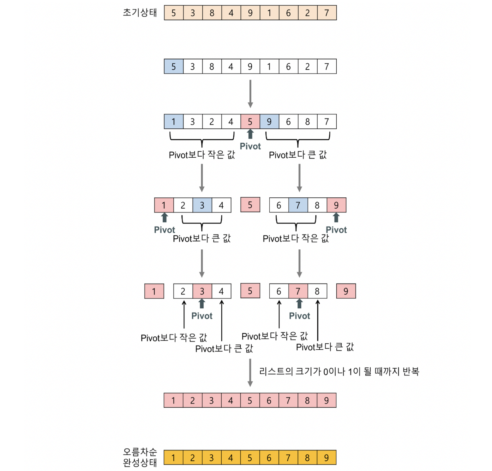

## 분할-정복 2

### 퀵정렬(Quick Sort)



```java
public class QuickSort {
    private static void swap(int[] array, int a, int b){
        int temp = array[a];
        array[a] = array[b];
        array[b] = temp;
    }

    public static void quickSort(int[] array, int startIndex, int endIndex){
        if(startIndex >= endIndex) return;

        int pivot = array[startIndex];
        int leftIndex = startIndex+1;
        int rightIndex = endIndex;

        while(leftIndex <= rightIndex){
            while(leftIndex <= endIndex && array[leftIndex] < pivot){ //선행 조건문은 index out of bounds 방지
                leftIndex++;
            }
            while(rightIndex >= startIndex && array[rightIndex] > pivot){//선행 조건문은 index out of bounds 방지
                rightIndex--;
            }
            //현재 상황 : pivot보다 큰 값이 leftIndex에 있고 pivot보다 작은 값이 rightIndex에 있음. 혹은 교차함.
            if(leftIndex <= rightIndex){  //각 인덱스가 아직도 교차하지 않았으면 swap
                swap(array, leftIndex, rightIndex);
                leftIndex++;
                rightIndex--;
            }
						//교차 했다면 swap하지 않고 if문 통과 및 while 빠져나옴.
        }
        swap(array, startIndex, rightIndex);
        quickSort(array, startIndex, rightIndex-1);
        quickSort(array, rightIndex+1, endIndex);
    }
}
```

### 퀵 정렬의 시간복잡도

N = 2^k 개의 원소를 정렬한다고 가정할 때,

최선의 경우, 배열이 균등하게 이등분 되어 순환 호출의 깊이는 k가 된다. 각각의 단계에서 pivot을 올바르게 위치시키기 위한 비교 연산 횟수는 평균적으로 N번 이루어지므로 총 연산횟수는 O(kN)이다. 이때, k = logN 이므로 O(kN) = O(NlogN)이다.

베열이 이미 정렬되어있는 경우 최악의 시간복잡도를 가진다. 배열에서 원소가 한개씩만 분리되어 순환 호출의 깊이가 N이 된다. 각각의 단계에서 비교 연산이 평균적으로 N번 이루어지므로 총 연산횟수는 O(N^2)이다.

### 안정성과 제자리성

퀵 정렬은 정렬 후 동일한 원소에 대한 우선순위가 유지되지 않는다. 따라서 퀵 정렬은 불안정정렬(Unstable sort)이다. 기존 배열 이외의 추가적인 메모리를 거의 사용하지 않으므로 제자리정렬(In-place sort)이다.

```toc
```
