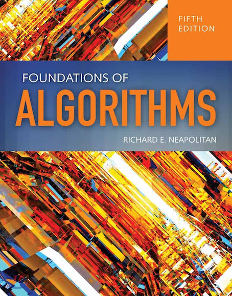

<center>교재 : Foundations of Algorithms</center>

### 알고리즘이란?

- 문제에 대한 답을 찾기 위해서 계산하는 절차이다
- 일반적인 단계적 절차를 명시한다.

---

### 문제의 표기

- 문제 : 해답을 찾으려고 물어보는 질문
- 매개변수(parameters)
  - 문제에서 어떤 특정 값이 지정되지 않는 변수
  - 문제의 입력(input)
  - 파라미터에 특정 값을 지정하면 “개별 문제”가 된다. 이렇게 파라미터에 지정할 값을 문제의 입력사례(instance)라고 한다.
  - 사례에 대한 대답(solution) : 출력(output)

---

### 알고리즘의 기술

- 자연어 : 한글 또는 영어 (부정확하고 모호함)
- 프로그래밍언어 : C, C++, Java, Pascal 등 (특정 언어에 의존적이어서 일반적인 알고리즘 기술에 부적합)
- 의사코드(Pseudo-code) : 직접 실행할 수 있는 프로그래밍 언어는 아니지만, 실제 프로그램에 거의 가깝게 계산과정을 표현할 수 있는 언어
- 알고리즘은 보통 의사코드로 표현한다.

---

### 의사코드 사용법

- 제어구조
  - repeat (n times) {…}
- 프로시저와 함수의 구분
  - 프로시저 : void pname(…) {…}
  - 함수 : returntype fname (…) {…}

and so on…

---

### 효율적인 알고리즘 개발의 중요성

- 순차검색 대 이분검색
  - 정렬된 배열 S, 배열의 크기는 n
  - 원소 x
  - Worst case (x ∉ S)
  - 순차 섬색 : n operations
  - 이분 검색 : lg n + 1 operations

---

### 순차검색

- 문제 : 크기가 n인 배열 S에 x가 있는가?
- 입력(파라미터) : (1) 양수n, (2) 배열S[1…n], (3) 키 x
- 출력 : x가 S의 어디에 있는지의 위치, 만약 없으면 0
- 알고리즘(자연어):
  - x와 같은 아이템을 찾을 때까지 S에 있는 모든 아이템을 차례로 검사한다
  - 만일 x와 같은 아이템을 찾으면 S에서 해당 위치를 출력하고, S를 모두 검사하고도 찾지 못하면 0을 출력한다.
- 순차검색 알고리즘으로 키를 찾기 위해서 S에 있는 항목을 몇 개나 검색해야 하는가?
  - 키와 같은 항목의 위치에 따라 다름
  - 최악의 경우 n
  - 평균의 경우 n/2
- 좀 더 빨리 찾을 수는 없는가?
  - 더 이상 빨리 찾을 수 있는 알고리즘은 존재하지 않는다.
  - 만약 배열 S가 정렬되어 있다는 정보가 존재한다면? → 이진검색

---

### 이진검색

- 문제: 크기가 n인 정렬된 배열 S에 x가 있는가?
- 입력(파라미터) : (1) 양수n, (2) 배열S[1…n], (3) 키 x
- 출력 : x가 S의 어디에 있는지의 위치, 만약 없으면 0
- 비교 획구를 (개략적으로) 분석해 본다
  - 배열의 크기가 32라면 6번의 비교가 필요하다 lg32 + 1 = 6
  - 배열의 크기가 64라면 7번의 비교가 필요하다 lg64 + 1 = 7
  - 배열의 크기가 $2^k$라면 k+1번의 비교가 필요하다 lg $2^k$+1 = k+1
- 이분검색 알고리즘으로 키를 찾기 위해서 S에 있는 항목을 몇개나 검색해야 하는가?
- while문을 수행할 때마다 검색 대상의 크기가 절반으로 감소하기 때문에 최악의 경우라도 lg n + 1번만 비교하면 된다

---

### 피보나치 수

- 재귀적 방식(JAVA)

```java
public static long oldpibo(int n){
        if(n <= 1){
            return n;
        }
        else{
            return oldpibo(n-1) + oldpibo(n-2); //재귀호출
        }
    }
```

- 동적 계획법(JAVA)

```java
static long[] dp = new long[100];//배열 선언
public static long newpibo(int n){
    if(n <= 1){
        return n;
    }
    else{
        if(dp[n] > 0){
            return dp[n]; //수가 존재하면 리턴
        }
        dp[n] = newpibo(n-1) + newpibo(n-2); //수가 없으면 채움
        return dp[n];
    }
}
```
```toc
```
